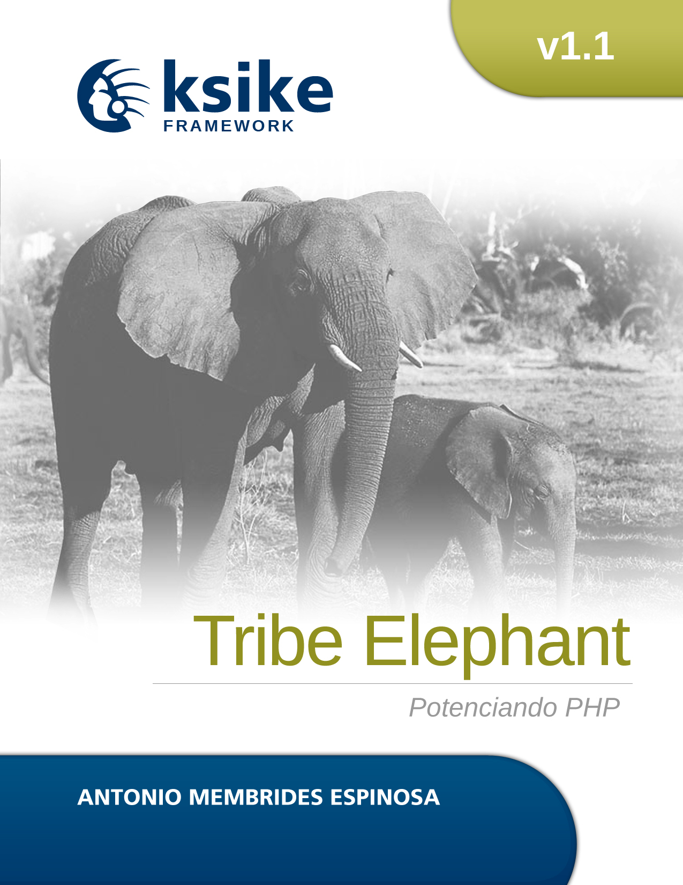

# Ksike Elephant Framework
Ksike Framework Elephant series, consists of a specialized framework for the PHP programming language, which incorporates a group of well structured architectural and design patterns, taking up the best practices of other frameworks of different technologies.

The develoments with Ksike it is a web application that has many of the characteristics of desktop application software. The concept is closely related to a single-page application, and may allow the user interactive features such as drag and drop, background menu, WYSIWYG editing, etc. HTML5 is a current standard for delivering rich web applications, supported by all major browsers. 

## Libs
In general, each of the libraries that make up the framework have their own independent development, which allows them to be used in other projects as well, some of it are listed below:

+ [LQL:  Light Query Language it is a query generator independent of data access layer](https://github.com/ameksike/ksike.elephant.lql) 
+ [Secretary: Lightweight library for data access abstraction](https://github.com/ameksike/ksike.elephant.secretary)
+ [Carrier: Dynamic class loading through a list of previously defined namespaces](https://github.com/ameksike/ksike.rhino.ui)
+ [Notary: Simple and light template engine for php and html support](https://github.com/ameksike/ksike.elephant.notary)

There are other editions of this framework oriented to other technologies such as PHP, JAVA, Python. The main idea is to keep the same concepts in the development of computer applications.

+ [Ksike Framework: Larva - focus on rich internet application development also known as RIA](https://github.com/ameksike/ksike.larva)
+ [Ksike Framework: Elephant - focus on PHP](https://github.com/ameksike/ksike.elephant)
+ [Ksike Framework: Rhino - focus on JavaScript and Node.js](https://github.com/ameksike/ksike.rhino.framework) 
+ [Ksike Framework: Coffee Cup - focus on Java](https://github.com/ameksike/ksike.java.core.plugin)

### Similar projects 
+ [Zeotool: Microframework developed to create CLI applications in PHP language](https://github.com/ameksike/zeotool)
+ [Apayus: PHP Microframework implemented to develop custom web applications](https://github.com/ameksike/apayus)
+ [Bycod: PHP Microframework based on Ksike Framewok Elephant](https://github.com/ameksike/bycod)
+ [Bhike: Integrated Development Environment (IDE) for Ksike Framewok](https://github.com/ameksike/bhike)

# 

Ksike Framework serie Elephant, consiste en un marco de trabajo especializado para el lenguaje de programación PHP, el cual incorpora una serie de patrones arquitectónicos y de diseño bien estructurados, retomando las mejores prácticas de otros marcos de trabajo de distintas tecnologías.

